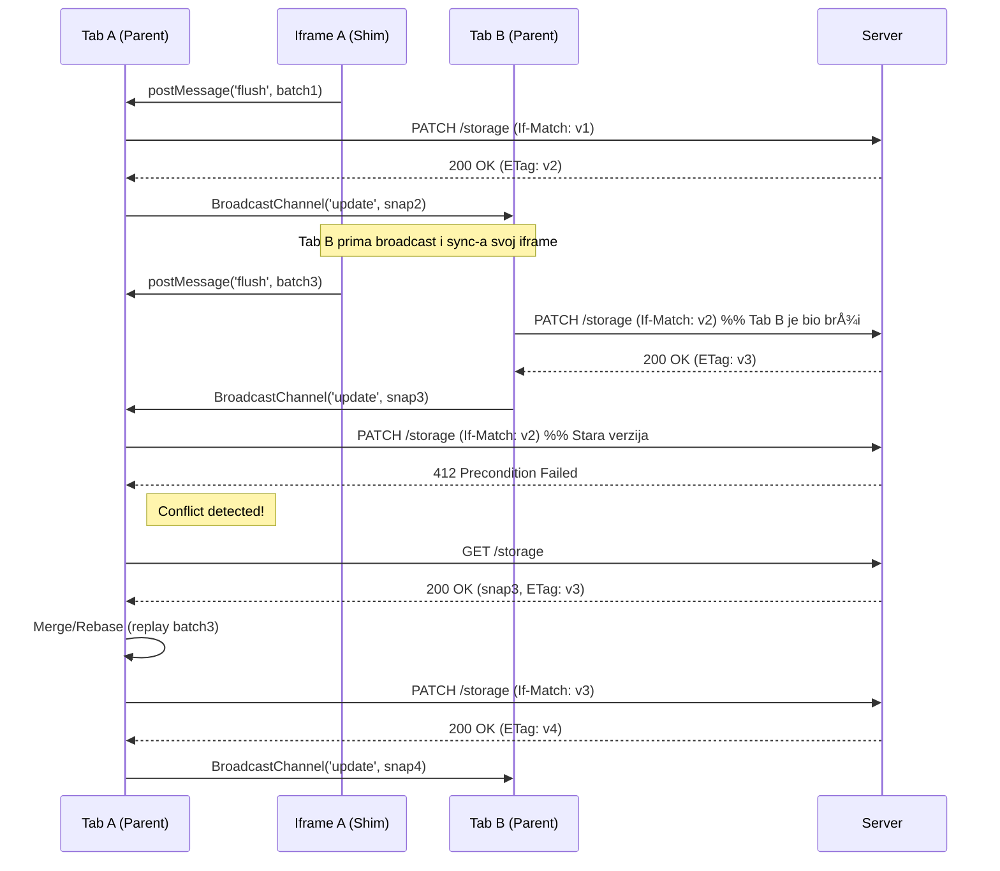

## F11 — Production Hardening
- **Auth signer:** parent koristi `GET /api/jwt` (ili `?token=`) za kratkotrajni JWT; refresh je re‑sign.
- **CSP:** prod parent ostaje strogo ograničen (nema Firebase domena). Dev može privremeno dopustiti Firebase domenama uz flag.
- **Firebase izolacija:** parent ne inicijalizira Firebase; ako je potrebno u devu, radi uvjetno i dinamički.
- **Namespace:** konfigurirano env varijablom `NEXT_PUBLIC_STORAGE_NS_MODE`.

## Faza 10 — JWT Refresh & Retry (parent-only)

Sekvenca: `GET /storage` → **401** → `POST /api/auth/refresh` → retry `GET` → **200**. Token se čuva u memoriji parenta, s proaktivnim osvježavanjem (T‑60s) i jedinstvenim refresh lockom. Iframe nikad ne vidi JWT.

# Thesara Storage Migration

This document outlines the migration of the app storage mechanism.

## Faza 8 — API Hardening

Phase 8 focuses on making the Storage API more robust, secure, and observable.

- **Strict Validation**: The `PATCH /api/storage` endpoint now enforces strict server-side validation for batch requests. This includes limits on the number of operations (max 100), the size of individual values (max 16KB), and the structure of each operation (`set`, `del`, `clear`). This prevents malformed or excessively large requests from impacting the system.
- **Rate Limiting**: A specific rate limit has been applied to the `PATCH` endpoint (6 requests per 10 seconds per user/namespace) to prevent abuse and ensure fair usage. Exceeding the limit will result in a `429 Too Many Requests` error.
- **ETag Normalization**: ETag handling is now stricter. The `ETag` response header is always a quoted string (e.g., `"12345"`), and the `If-Match` request header is handled robustly, regardless of whether it includes quotes.
- **Metrics & Observability**: New Prometheus metrics have been introduced to provide better insight into the API's usage and performance. This includes counters for total patch requests, successes, conflicts (`412`), and rate-limited requests, as well as a histogram for request duration.

**Reading Metrics:**

The new metrics are available at the `/metrics` endpoint. Key metrics to monitor include:
- `storage_patch_total`: Total number of patch requests.
- `storage_patch_success_total`: Successful updates.
- `storage_patch_412_total`: Version conflicts, indicating clients are trying to update with a stale version.
- `storage_patch_rate_limited_total`: Number of blocked requests due to rate limiting.
- `storage_patch_duration_seconds`: Latency of patch requests, useful for identifying performance issues.

**Example `curl` commands for testing:**

```bash

# Test for invalid batch (e.g., op missing key)
curl -i -X PATCH -H "Authorization: Bearer $JWT" -H 'If-Match: "v1"' -H 'Content-Type: application/json' \
  --data '[{"op":"set"}]' "https://api.thesara.space/api/storage?ns=test"

# Test rate limiting (run this loop)
for i in {1..8}; do \ 
  curl -s -o /dev/null -w "%{http_code}\n" -X PATCH -H "Authorization: Bearer $JWT" -H 'If-Match: "v1"' -H 'Content-Type: application/json' \
  --data '[{"op":"set","key":"k","value":1}]' "https://api.thesara.space/api/storage?ns=ratelimit-test"; sleep 0.5; \ 
done
```

## Faza 7 — CI & QA Automation

- Dodan GitHub Actions workflow `E2E (Playwright)` koji se pokreće na svakom PR‑u i pushu na `main`.
- Artefakti (report, trace, video) uploadaju se na fail radi bržeg debugiranja.
- Preporuka: postaviti ovaj job kao **Required** u branch protection pravilima.

### Ključni E2E scenariji

1.  **412 Conflict & Retry Test**:
    -   **Setup**: Otvoriti dvije instance (taba) iste Play aplikacije.
    -   **Akcija A**: Prva instanca uspješno izvrši `PATCH` operaciju.
    -   **Akcija B**: Druga instanca pokuša `PATCH` s istim (sada zastarjelim) `If-Match` headerom.
    -   **Assert 1**: API vraća `412 Precondition Failed`.
    -   **Assert 2**: Klijent u drugoj instanci detektira 412, automatski radi `GET` za novi ETag i stanje, ponavlja `PATCH` operaciju (replay) i dobiva `200 OK`. U konzoli nema `uncaught` grešaka.

2.  **Legacy CSP Test**:
    -   **Setup**: Programski se kreira build koji rezultira s `entry: "app.js"` u manifestu (bez bundlea i SRI hasha).
    -   **Akcija**: Učitati Play stranicu s tim buildom.
    -   **Assert**: Aplikacija se ispravno renderira. U konzoli nema CSP grešaka, što potvrđuje da je relaksirana CSP politika ispravno primijenjena i dovoljna za rad aplikacije.

## Faza 6 — Deprecation & Cleanup

As of 2025-10-23, the legacy "rooms auto-bridge" feature is deprecated and has been removed. All API routes under `/rooms/v1/bridge` and `/rooms/bridge` will now return a `410 Gone` status.

**Reasoning:** The auto-bridge was a temporary shim to synchronize `localStorage` between the main window and sandboxed iframe apps. The new Storage API (`GET/PATCH /api/storage`) provides a more robust, generic, and secure solution.

**Migration:** Client-side code must be updated to use the Storage API for persisting data. Communication between the iframe and the parent window should be handled via `postMessage` to interact with the Storage API.

## Faza 4: Messaging i batch sinkronizacija

Phase 4 introduces a robust, multi-tab-aware storage synchronization system using a `postMessage` proxy between the parent window and the sandboxed iframe, with `BroadcastChannel` for cross-tab communication.

### Arhitektura

1.  **`shim.js` u Iframeu**: Skripta koja se učitava u `iframe` presreće pozive `localStorage` (`setItem`, `removeItem`, `clear`), grupira ih u `batch` i periodički šalje `parent` prozoru putem `window.parent.postMessage({ type: 'thesara:storage:flush', ... })`.
2.  **`PlayPageClient.tsx` (Parent)**: Glavna stranica koja hosta `iframe`. Sluša poruke iz `shim.js`.
    *   Na `thesara:storage:flush`, poziva `patchStorage` s `If-Match` headerom koji sadrži trenutnu verziju (`ETag`) snapshot-a.
3.  **`snapshot-loader.ts`**: Sadrži logiku za mrežne pozive:
    *   `fetchSnapshot`: Dohvaća trenutno stanje i verziju storage-a.
    *   `patchStorage`: Å alje `PATCH /api/storage` s batchom izmjena.

### Tijek sinkronizacije i rješavanje konflikata (412)

Ključni dio ove faze je rješavanje konflikata koji nastaju kada više tabova istovremeno mijenja stanje.



**Retry/Merge strategija:**

*   Kada `PATCH` ne uspije s `412 Precondition Failed`, klijent zna da mu verzija nije ažurna.
*   **Backoff**: Prije ponovnog pokušaja, čeka se kratki period (npr. 100ms, 250ms, 500ms).
*   **Refetch**: Klijent radi `GET /api/storage` da dohvati najnoviji snapshot i `ETag` (verziju).
*   **Replay**: Klijent zatim ponovno šalje svoj `batch` izmjena, ali ovaj put s najnovijim `If-Match` headerom. Ova "replay" strategija je konzervativna; oslanja se na backend da korektno spoji promjene. Ako `batch` sadrži `clear`, on ima prioritet i briše sve prethodne promjene u tom `batchu`.
*   Ako i nakon 3 pokušaja operacija ne uspije, odustaje se, a stanje će se ispraviti sa sljedećom `sync` porukom primljenom preko `BroadcastChannel`-a.

### Faza 7 — QA & Validation
- Sandbox bez `allow-same-origin` potvrÄ‘en (Playwright + ruÄni check)
- Init: `GET /api/storage` prije rendera iframe app-a
- Batching: 5 promjena → 1 PATCH (~2s)
- Multi‑tab: BroadcastChannel sync → iframe prima `thesara:storage:sync`
- 412 handling: refetch → merge/replay → uspjeh (max 3 pokušaja)
- JWT izolacija: u iframe-u nema JWT-a

## Faza 5 — Enforcement

As of 2025-10-23, CORS policies on the Fastify API server have been corrected to properly handle preflight `OPTIONS` requests, allow the `Authorization` header, and expose the `ETag` header for caching. This ensures secure and efficient communication between the web client and the API.
## Faza 9 — Messaging Hardening

- Uveden **capability token** (parent → iframe init; sve naredne poruke nose `cap`).
- Parent validira i `event.source` i `cap` prije obrade poruka.
- Shim čuva `cap` u closureu; ne izlaže ga na `window`.
- Dodan **offline queue** i `ack` poruka; flush na `online`/`visibilitychange`/`pagehide`.
- Uređen lifecycle (unsubscribe, `BroadcastChannel.close()`).

### Production bundling — verification

- Run `scripts/verify-bundle.ps1 -BuildId <id> -BaseUrl <api>` (or `.sh`) and confirm it reports `BundleSizeBytes` with no bare imports or `react/jsx-dev-runtime`.
- `GET /builds/<id>/build/manifest_v1.json` should return `entry: "./app.bundle.js"` with an `integrity` value that matches the script tag in `index.html`.
- `curl -I /builds/<id>/build/index.html` must expose a single CSP stanza for the bundled asset and include `crossorigin="anonymous"`.

## Alias za Play assete

- Zašto: Play loader na web klijentu dohvaća bundle preko `/{appId}/build/*`, dok backend čuva najnoviji build pod `/builds/{buildId}/build/*`. Alias spaja te putanje bez promjena na loaderu.
- Primjer: `GET /46/build/manifest_v1.json -> 307 -> /builds/<buildId>/build/manifest_v1.json`.
- Napomena: Redirect je transparentan; CSP zaglavlja, bundling i statički handleri ostaju nepromijenjeni. Stabilni URL `/{listingId}/build/*` služi samo za dohvat zadnjeg `buildId`.

---

## Faza 12 — SSE & Real-time UI

Kako bi se poboljšalo korisničko iskustvo prilikom objave aplikacije, uvodi se real-time praćenje statusa builda putem Server-Sent Events (SSE).

### SSE Endpoint

-   **Ruta**: `GET /build/:buildId/events`
-   **Headers**: `Content-Type: text/event-stream`, `Cache-Control: no-cache`, `Connection: keep-alive`. CORS mora biti ispravno konfiguriran.
-   **Eventi**: Server šalje događaje u `event: <ime>\ndata: <json>\n\n` formatu.
    -   `event: status`: Šalje se za svaku promjenu stanja build procesa.
        -   `data: {"buildId":"...", "status":"queued"}`
        -   `data: {"buildId":"...", "status":"analyze", "reason":"..."}`
        -   `data: {"buildId":"...", "status":"build"}`
        -   `data: {"buildId":"...", "status":"bundle"}`
        -   `data: {"buildId":"...", "status":"verify"}`
        -   `data: {"buildId":"...", "status":"ai_scan"}`
        -   `data: {"buildId":"...", "status":"llm_generating"}`
    -   `event: ping`: Periodični heartbeat (svakih 15s) s `id` i `ts`.
    -   `event: llm_report`: Šalje kompletan AI izvještaj kada je gotov.
    -   `event: final`: Označava kraj procesa.
        -   `data: {"status":"published", "reason":"approved", "buildId": "..."}`
        -   `data: {"status":"rejected", "reason": "...", "buildId": "..."}`

### UI Integracija

-   **Povezivanje**: Klijent koristi `EventSource` za spajanje na `/build/:buildId/events`.
-   **UX**:
    -   Tijekom procesa prikazuje se poruka "Publishing..." s detaljem trenutne faze (npr., "Bundling...").
    -   Na `final` event sa statusom `published`, prikazuje se CTA gumb "Open Play".
    -   Na `final` event sa statusom `failed`, prikazuje se poruka o grešci s `reason` i opcijama "Retry" ili "View Logs". Na `llm_report` se ažurira prikaz AI analize.
-   **Robusnost**: U slučaju prekida SSE konekcije, klijent automatski pokušava ponovno spajanje (npr., uz exponential backoff).

---

## Definition of Done (DoD)

-   [x] **SSE**: Server implementira `/build/:buildId/events`. UI prikazuje real-time status builda i podržava reconnect.
-   [ ] **E2E Testovi**: Playwright suite prolazi, uključujući "zeleni" put, **412 conflict/retry scenarij** i **legacy CSP scenarij**.
-   [ ] **CSP Dokumentacija**: Dokumentacija je usklađena sa stvarnom implementacijom.
-   [ ] **Smoke Testovi**: Svi brzi testovi (HEAD/GET na artefakte, boot bez CSP grešaka) prolaze nakon svakog deploya.
-   [ ] **Build Status API**: Sustav koristi perzistirani status builda umjesto dinamičkog mijenjanja manifesta.
