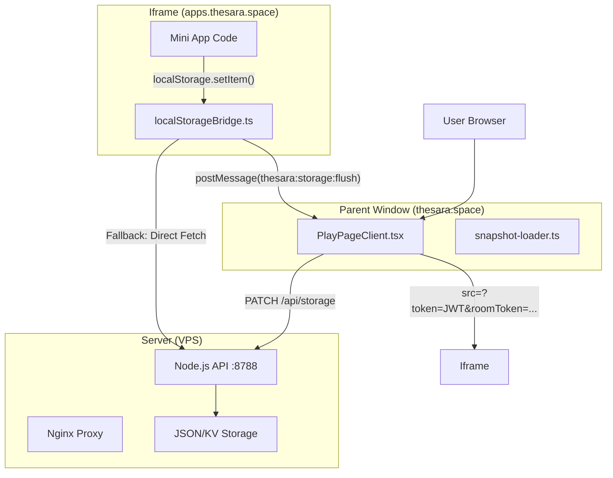

# Thesara Shim System Documentation
**Date:** 2025-12-04
**Status:** STABLE (Restored)

## 1. Overview & Architecture

The Thesara Shim System allows mini-applications (running in sandboxed iframes on `apps.thesara.space`) to persist data securely to the Thesara backend (`thesara.space`), enabling multi-device synchronization and "rooms" functionality.

### Core Concept
Mini-apps use standard `localStorage` API. The Shim intercepts these calls and:
1.  **Caches** them locally in memory.
2.  **Syncs** them to the parent window (`PlayPageClient`) via `postMessage`.
3.  **Persists** them to the backend via `/api/storage`.

### Architecture Diagram



---

## 2. Critical Components & Code

### 2.1. The Shim (`localStorageBridge.ts`)
**Location:** `apps/api/src/shims/localStorageBridge.ts`
**Role:** Intercepts storage calls inside the iframe.

**CRITICAL RULES:**
*   **Do NOT** use dynamic namespace switching that relies on `let` variables if it introduces syntax errors. Keep `NS` and `APP_ID_HEADER` as `const` derived from initial state.
*   **Must be served as a static file** via `/shims/localstorage.js`.
*   **Must handle `postMessage` security** (check `event.source === parentWindow`).

**Working Code Snippet (Key Parts):**
```typescript
// ... imports and setup ...

const parentWindow = window.parent;
const STANDALONE = !parentWindow || parentWindow === window;

// 1. Get Namespace & Token from URL/Window
const NS = getNamespace(); 
// ^^^ MUST be const to avoid runtime reassignment bugs
const APP_ID_HEADER = NS.startsWith('app:') ? NS.slice(4) : NS;

// 2. Intercept localStorage
Object.defineProperty(window, 'localStorage', {
  configurable: false,
  enumerable: true,
  get() { return localFacade; }, // Custom facade implementation
});

// 3. Handle Messages from Parent
window.addEventListener('message', handleMessage);
function handleMessage(event) {
  if (event.source !== parentWindow) return; // Security check
  // Handle 'thesara:storage:init', 'thesara:storage:sync', etc.
}
```

### 2.2. The Host (`PlayPageClient.tsx`)
**Location:** `apps/web/app/play/[appId]/PlayPageClient.tsx`
**Role:** Loads the iframe and manages synchronization.

**CRITICAL RULES:**
*   **MUST include tokens in Iframe URL:** The `src` attribute of the iframe **MUST** contain `?token=...` and `&roomToken=...`.
    *   *Why?* If `postMessage` is delayed or fails, the Shim needs these tokens to perform a "Direct Sync" fallback to the API. Without them, it gets `403 Forbidden`.
*   **Must wait for Bootstrap:** Do not render the iframe until initial data (snapshot) is fetched from the server.

**Correct Iframe Rendering:**
```tsx
// BAD (Caused the outage):
// <iframe src={baseIframeSrc} ... />

// GOOD (Working):
<iframe 
  src={withToken(baseIframeSrc, jwt, { 
    ns: activeNamespace, 
    roomToken: roomTokenRef.current 
  })} 
  ... 
/>
```

### 2.3. Server Injection (`publish.ts`)
**Location:** `apps/api/src/routes/publish.ts`
**Role:** Injects the shim script tags into the user's HTML during publishing.

**Required Script Tags:**
```html
<script>
  window.__THESARA_APP_NS = "app:48";
  window.__THESARA_APP_ID__ = "48";
  // ... other globals
</script>
<script type="module" src="/shims/rooms.js?v=BUILD_ID"></script>
<script type="module" src="/shims/storage.js?v=BUILD_ID"></script>
<script src="/shims/localstorage.js?v=BUILD_ID"></script> <!-- THE SHIM -->
```

---

## 3. Infrastructure Configuration

### 3.1. Nginx Configuration
**Files:** `/etc/nginx/sites-available/thesara.space` & `apps.thesara.space`

**Problem:** If `/shims/` is not proxied, the browser gets 404, and the shim never loads.

**Correct `thesara.space` Config (Snippet):**
```nginx
server {
    server_name thesara.space;

    # Proxy /shims/ to the API (Port 8788)
    location ^~ /shims/ {
        proxy_pass http://127.0.0.1:8788;
        proxy_http_version 1.1;
        proxy_set_header Upgrade $http_upgrade;
        proxy_set_header Connection 'upgrade';
        proxy_set_header Host $host;
        proxy_cache_bypass $http_upgrade;
    }

    # Proxy /api/ to the API (Port 8788)
    location /api/ {
        # IMPORTANT: No trailing slash after 8788 to preserve /api/ path
        proxy_pass http://127.0.0.1:8788; 
        # ... standard headers ...
    }
    
    # ... other locations ...
}
```

**Correct `apps.thesara.space` Config:**
Needs similar proxying if shims are loaded from `apps.thesara.space` (which they often are due to relative paths).

### 3.2. Server Deployment Commands
After changing Shim code or API routes:

```bash
cd /srv/thesara/app
git pull origin main

# Rebuild API (compiles TS to JS in dist/)
pnpm -F @thesara/api build

# Restart Process
pm2 restart thesara-api
```

---

## 4. Troubleshooting & Warnings (Post-Mortem)

### What went wrong on 2025-12-04?
1.  **Token Removal:** An optimization in `PlayPageClient.tsx` removed the token from the iframe `src` to avoid a "restart" effect.
    *   **Result:** Shim loaded but couldn't authenticate with the API (`403 Room Token Missing`). Data wasn't saved.
2.  **Nginx Misconfiguration:** `/shims/` path wasn't proxied initially.
    *   **Result:** Shim returned 404. Native `localStorage` was used, trapping data locally.
3.  **Syntax Error in Shim:** Attempting to fix the namespace logic introduced a syntax error (`Unexpected identifier`).
    *   **Result:** Shim crashed on load.

### How to verify the system is working?
1.  **Console Check (Iframe Context):**
    *   Run `window.__THESARA_SHIM_DEBUG__ = '1'`
    *   Run `localStorage.setItem('test', '123')`
    *   Look for `[Thesara Shim] sent batch to parent` or `directSync`.
2.  **Network Check:**
    *   Look for `PATCH /api/storage...` requests with status `200`.
3.  **Persistence Check:**
    *   Reload page. `localStorage.getItem('test')` should return `'123'`.

---

## 5. Replication Steps (From Scratch)

To rebuild this system:

1.  **Backend:** Ensure `apps/api` has `localStorageBridge.ts` and serves it via a route in `shims.ts`.
2.  **Frontend:** Ensure `PlayPageClient.tsx` fetches a snapshot *before* mounting the iframe, and passes `token` + `roomToken` in the iframe URL.
3.  **Publishing:** Ensure `publish.ts` injects the `<script src="/shims/localstorage.js">` tag.
4.  **Infrastructure:** Configure Nginx to proxy `/shims/` requests to the Node.js API port.
5.  **CORS:** Ensure `apps.thesara.space` allows scripts from `thesara.space` (though usually same-origin is preferred for shims).

**End of Documentation**
